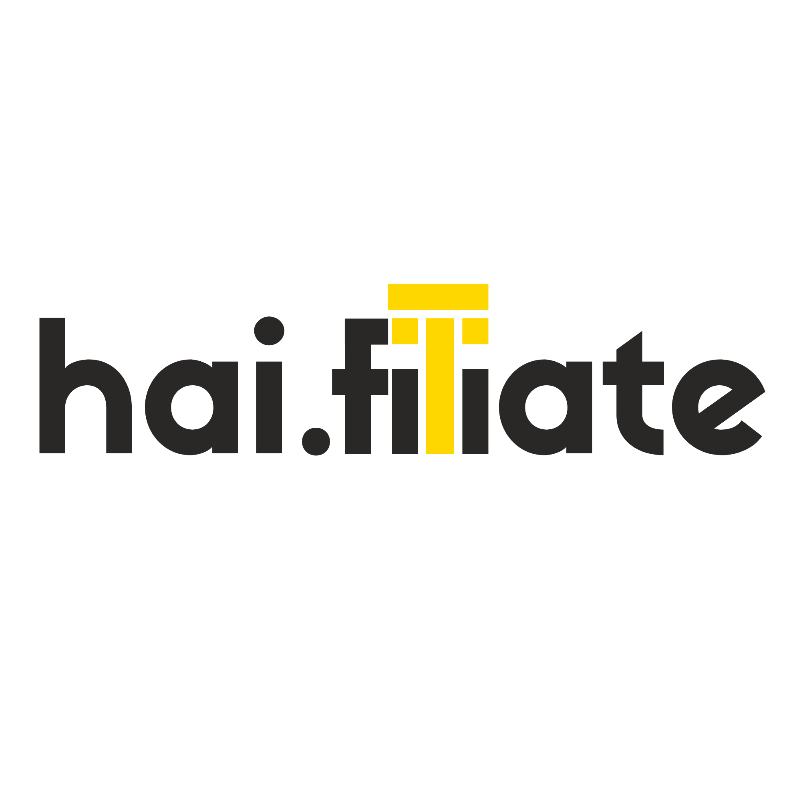

# Fitur Baru: Halaman Prompt Skrip Gratis

## Ringkasan
Tambahkan satu section baru di homepage + satu halaman baru berisi template prompt
gratis (script writer untuk skrip video affiliate). Ini alat GRATIS tanpa syarat beli,
terpisah dari section "Bonus" yang isinya barang berbayar.

---

## A. Section baru di homepage (index.html)

**Posisi:** setelah section "Isi Produk", sebelum section "Bonus".

```html
<section class="section-free-tool reveal-section" id="coba-gratis" aria-label="Coba Gratis Dulu">
  <div class="container">
    <p class="eyebrow-section"><span class="gold-rule" aria-hidden="true"></span>Coba Gratis Dulu</p>
    <h2>Nggak Perlu Beli Buat Coba Nilai Kita</h2>
    <p class="body-copy">
      Ini template prompt AI gratis buat bikin skrip video affiliate — lengkap dengan
      hook, agitasi masalah, solusi, sampai CTA. Tinggal copy, paste ke Claude, ganti
      info produk kamu. Nggak perlu beli apa pun buat pakai ini.
    </p>
    <a href="skrip-gratis.html" class="btn btn-secondary">
      Pakai Prompt Gratis →
    </a>
  </div>
</section>
```

Styling `.btn-secondary`: outline gold (bukan solid), supaya tidak bersaing visual
dengan CTA utama "Beli Sekarang" (solid gold) — harus jelas beda hierarki: CTA beli
adalah aksi utama halaman, ini cuma pintu masuk sekunder.

Update juga `sitemap.xml` — tambahkan entry untuk `skrip-gratis.html`.

---

## B. Halaman baru: skrip-gratis.html

File baru di root folder, reuse `css/style.css` dan `js/main.js` yang sudah ada.

### Meta (SEO — halaman ini WAJIB terindex, bukan noindex)

```html
<title>Prompt Gratis: Bikin Skrip Video Affiliate TikTok/Reels dalam Menit | hai.filiate</title>
<meta name="description" content="Template prompt AI gratis untuk bikin skrip video affiliate TikTok Shop & Shopee — lengkap hook, agitasi, solusi, CTA, timing, dan intonasi. Copy-paste ke Claude, langsung pakai." />
<link rel="canonical" href="https://haifiliate.shop/skrip-gratis.html" />
```
Plus Open Graph & Twitter Card tags dengan pola yang sama seperti di index.html
(title/description di atas, og:image boleh reuse ebook-mockup.jpeg atau bikin
gambar baru khusus kalau sempat — tidak wajib).

### Header kecil (navigasi balik, khusus halaman ini)

```html
<header class="page-header">
  <div class="container">
    <a href="index.html" aria-label="Kembali ke halaman utama hai.filiate">
      
    </a>
  </div>
</header>
```
(pakai `logo_black.png` kalau background section ini terang, `logo_white.png` kalau
gelap — sesuaikan dengan token warna section pertama halaman ini, cek kontrasnya)

### Isi halaman, urutan section:

**1. Hero halaman ini**
```
Eyebrow: Gratis
H1: Template Prompt: Bikin Skrip Video Affiliate dalam Hitungan Menit
Subhead: Tempel prompt ini ke Claude (atau AI chat lain), ganti beberapa bagian
sesuai produk kamu, dan skrip video TikTok/Reels/Shorts siap pakai langsung keluar
— lengkap dengan timing, intonasi, dan arahan visual.
Small note: Ini alat gratis dari hai.filiate. Nggak perlu beli apa pun buat pakai ini.
```

**2. Cara Pakai (3 langkah, pakai komponen step yang sama gayanya dengan section
"Cara Kerja" di homepage)**
```
1. Salin seluruh prompt di bawah (klik tombol "Salin Prompt")
2. Buka Claude (claude.ai) atau AI chat favorit kamu, tempel prompt-nya
3. Ganti bagian [DALAM KURUNG SIKU] dengan info produk kamu, lalu kirim
```

**3. Blok prompt + tombol salin**

Struktur HTML:
```html
<div class="prompt-block-wrapper">
  <div class="prompt-block-header">
    <span>Prompt Script Writer — Video Affiliate</span>
    <button type="button" class="btn-copy" id="copyPromptBtn" aria-live="polite">
      Salin Prompt
    </button>
  </div>
  <pre class="prompt-block" id="promptText">ISI PROMPT DI SINI (lihat di bawah)</pre>
</div>
```

Isi persis `id="promptText"` (teks asli, jangan diedit/diringkas):

```
Anda adalah seorang scriptwriter video pendek (TikTok/Reels/Shorts) yang ahli dalam direct-response copywriting dan storytelling berbasis psikologi audiens Indonesia. Anda akan menulis skrip video affiliate/promosi yang SANGAT detail — bukan cuma dialog, tapi lengkap dengan timing, intonasi suara, jeda (pause), dan deskripsi visual pendukung di setiap segmen.

KONTEKS PRODUK:
Nama produk: [MASUKKAN NAMA PRODUK]
Deskripsi produk: [MASUKKAN DESKRIPSI PRODUK — termasuk apa isinya, siapa target pembeli, masalah apa yang diselesaikan, harga jika relevan]
Format konten: [MASUKKAN FORMAT, misal: "edukasi produk" / "review produk" / "testimoni" — sesuaikan dengan angle yang Anda mau]
Platform: [TikTok / Reels / Shorts / Campuran TikTok + Reels + Shorts]
Gaya video: Sesuaikan dengan format konten — voice-over + visual b-roll/motion graphic pendukung.
Durasi target: [MASUKKAN DURASI, misal: 45-60 detik]

TUGAS ANDA:
Tulis SATU skrip video lengkap dengan struktur 4 babak berikut:
1. HOOK (0 - X detik): kalimat pembuka yang relate ke masalah audiens, harus menghentikan scroll dalam 3 detik pertama.
2. AGITASI MASALAH (X - Y detik): memperdalam rasa "ini gue banget", bangun ketegangan/urgensi sebelum solusi muncul.
3. SOLUSI / DEMO (Y - Z detik): perkenalkan produk sebagai solusi, jelaskan cara kerja atau hasil yang didapat secara konkret.
4. CTA (Z - akhir): ajakan bertindak yang jelas, arahkan ke keranjang kuning / link / DM, dengan urgensi secukupnya tanpa terasa memaksa.

FORMAT OUTPUT — WAJIB gunakan struktur persis seperti ini untuk SETIAP segmen:
---
[NOMOR] [NAMA BABAK — HOOK / AGITASI MASALAH / SOLUSI / CTA]
[rentang waktu, misal: 0–6 detik]
"[Kalimat voice-over persis seperti yang akan diucapkan, dalam Bahasa Indonesia casual/natural]"
🔊 Intonasi: [deskripsi singkat nada bicara, misal: "pelan, datar, relatable" atau "naik bertahap, energik"]
⏱ Jeda: [instruksi jeda spesifik, misal: "jeda 1 detik setelah kata X" — boleh lebih dari satu jeda per segmen]
🎬 Visual: [deskripsi singkat 1 kalimat tentang ADEGAN/ISI visual saja — cukup sebutkan subjek dan jenis shot secara umum, misal: "close up jam digital di kamar" atau "macro botol suplemen di atas meja" atau "pria terbaring kelelahan". Tulis sebagai catatan arah visual yang ringkas untuk referensi editor, bukan deskripsi teknis yang panjang dan berlapis]
---

ATURAN PENULISAN:
- Bahasa Indonesia sehari-hari, natural diucapkan, BUKAN bahasa baku/formal kaku
- Kalimat per segmen singkat-singkat (maksimal 2-3 kalimat), karena ini voice-over dengan ritme cepat
- Kolom Visual ditulis singkat dalam Bahasa Indonesia, cukup 1 kalimat sederhana tentang adegan yang muncul — hindari deskripsi panjang dengan banyak detail teknis sekaligus (lighting, color grading, camera movement, style keywords)
- Total durasi seluruh segmen harus konsisten dengan durasi target yang disebutkan
- Jangan klaim hasil/penghasilan pasti, hindari angka komisi spesifik yang tidak bisa dipertanggungjawabkan
- Setelah skrip selesai, berikan juga CAPTION siap pakai (1-2 kalimat + 5-8 hashtag relevan) di bagian paling bawah

Setelah menulis skrip, tunggu instruksi saya — jangan generate variasi lain kecuali saya minta.
```

**JS untuk tombol salin** (tambahkan ke `js/main.js`, bukan file terpisah):
```js
(function initCopyPrompt() {
  const btn = document.getElementById('copyPromptBtn');
  const promptEl = document.getElementById('promptText');
  if (!btn || !promptEl) return;

  btn.addEventListener('click', async () => {
    try {
      await navigator.clipboard.writeText(promptEl.textContent);
      const original = btn.textContent;
      btn.textContent = 'Tersalin!';
      btn.classList.add('is-copied');
      setTimeout(() => {
        btn.textContent = original;
        btn.classList.remove('is-copied');
      }, 2000);
    } catch (err) {
      btn.textContent = 'Gagal, coba salin manual';
    }
  });
})();
```
Catatan aksesibilitas: tombol punya `aria-live="polite"` di HTML supaya perubahan
teks "Tersalin!" terbaca screen reader. Fallback: kalau `navigator.clipboard` tidak
tersedia (browser lama/http non-secure), tombol tetap kasih tahu user untuk select-all
manual — jangan biarkan gagal diam-diam.

**4. Contoh Pengisian (accordion, collapsed by default — pakai komponen `<details>`
yang sama seperti FAQ)**
```
Judul: Contoh Pengisian (Niche Herbal/Suplemen)

Nama produk: Madu Herbal Imunitas XYZ
Deskripsi produk: Suplemen herbal cair berbahan madu dan rempah (jahe/kunyit) untuk
menjaga daya tahan tubuh, dikonsumsi 1-2 sendok per hari, dijual di TikTok Shop
seharga Rp89.000, target pembeli usia 25-45 tahun yang sering kelelahan/gampang
sakit karena rutinitas padat.
Format konten: Edukasi ringan tentang pentingnya imun tubuh dikombinasikan dengan
masalah kelelahan harian, lalu perkenalkan produk sebagai solusi praktis.
Platform: Campuran TikTok + Reels + Shorts
Durasi target: 40 detik
```

**5. Cross-sell ke ebook & bot (section penutup, sebelum footer)**
```
Headline: Skrip Ini Kasih Tau APA yang Diomongin. Visualnya Gimana?
Body: Tiap segmen skrip di atas (Hook, Agitasi, Solusi, CTA) butuh visual yang
matching — angle kamera, pencahayaan, gerakan, semuanya harus spesifik biar hasil
Veo AI-nya nggak generic. VEO AI Affiliate Mastery kasih 60+ prompt visual siap
pakai, plus akses bot Telegram yang bisa generate prompt visual custom sesuai
skrip kamu sendiri — bukan cuma buat sekali pakai, tapi buat produk apa pun ke
depannya.
Trust line (angka sama persis dengan homepage): 33 halaman · 7 bab · 60+ prompt · + Bot Telegram

[ Beli Sekarang — Rp49.000 ]  ← CTA solid gold, link SAMA PERSIS dengan checkout
                                 di homepage (jangan bikin URL baru)
Lihat semua yang kamu dapat →  ← text link ke index.html#bonus
```

**6. Footer** — reuse persis footer homepage (social links, WhatsApp admin,
disclaimer Veo AI/Google). Jangan duplikasi kode CSS, pastikan class-nya sama
supaya konsisten.

---

## C. Aturan yang tetap berlaku di halaman baru ini
- TIDAK ADA sebutan "Lynk.id" di teks manapun (sama seperti homepage)
- TIDAK ADA urgency/scarcity palsu (bukan "buruan sebelum harga naik" — pakai
  framing value-based seperti draft di atas)
- Kontras warna & responsivitas sama standarnya dengan homepage (cek 360px–1440px)
- `prefers-reduced-motion` tetap dihormati kalau ada reveal animation di halaman ini juga

## D. Setelah selesai
- Update `sitemap.xml` (tambah URL skrip-gratis.html)
- Jalankan local server, cek: tombol salin berfungsi, link CTA beli sama persis
  dengan homepage, link "kembali ke halaman utama" berfungsi
- Commit & push ke repo yang sama
